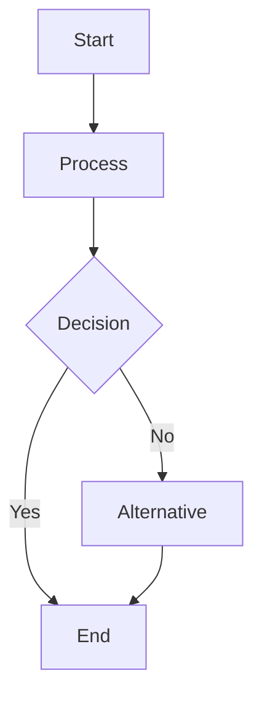

# Logbog

## 2026/01/15
Vi opstartede på projektet, hvor vi skulle vælge programmerings sprog og hvilken slages bot vi ville lave.

Vi blev enige om at lave en Discord bot, og skrive det i Rust, fordi ellers ville Hjalte have lavet den i søvne.

## 2026/01/22
Vi skulle lave en kort diagram, om hvordan vi forestiller os den endelige bot nogenlunde skal fungere.

Udover dette er vi blevet enige om at skifte til Python, efter Hjalte viste Ahed og Noah hvor simpelt det er i modsætning til Rust.

---

# Bruger Historie 1: Ping
