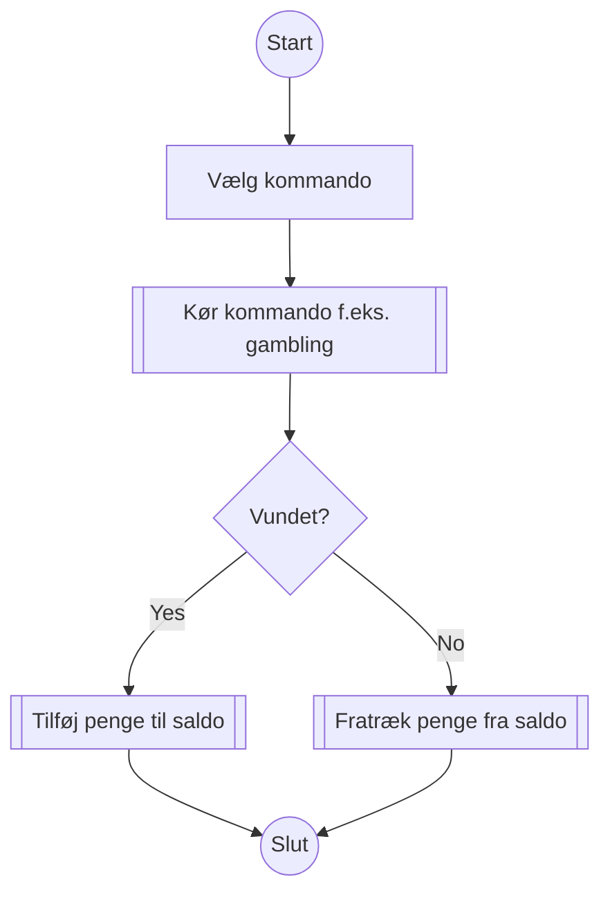

# Logbog

## 2026/01/15
Vi opstartede på projektet, hvor vi skulle vælge programmerings sprog og hvilken slages bot vi ville lave.

Vi blev enige om at lave en Discord bot, og skrive det i Rust, fordi ellers ville Hjalte have lavet den i søvne.

## 2026/01/22
Vi skulle lave en kort diagram, om hvordan vi forestiller os den endelige bot nogenlunde skal fungere.

Udover dette er vi blevet enige om at skifte til Python, efter Hjalte viste Ahed og Noah hvor simpelt det er i modsætning til Rust.

Opsatte basics i Python

```mermaid
graph TD
    A((Start)) --> B[Vælg kommando]
    B --> C[[Kør kommando f.eks. gambling]]
    C --> D{Vundet?}
    D -->|Yes| E[[Tilføj penge til saldo]]
    D -->|No| F[[Fratræk penge fra saldo]]
    E -->G((Slut))
    F -->G
```

## 2026/01/29
Noah satte economy system op

Ahed begyndte på black jack/parent class

Hjalte syg

## 2026/02/05
Noah daily login bonus 

Ahed generalt gambling logic ved implementation af polymporfi

Hjalte syg

---

## 2026/02/17
Ahed logic for black, samt test for gambling superclasset

Noah database setup for economy systemet

hjalte status server for discord botten, updatede på noahs database setup og lavte en simpel coinfilp command
## 2026/02/18
Ahed syg 
Noah ændrede på databasets kode, så det er mere effektivt og nemmere at bruge

Hjalte skiftede fra aiomysql til MySQL, updatede databasen også lavt en /adminballance, for at teste coin filp kommandoen

## 2026/02/25 
ahed lavede en fungerene black jack class som **burde** virke, mangler at teste det mangler dog at implemtere dette i core.py.
# Bruger Historie 1: Ping
